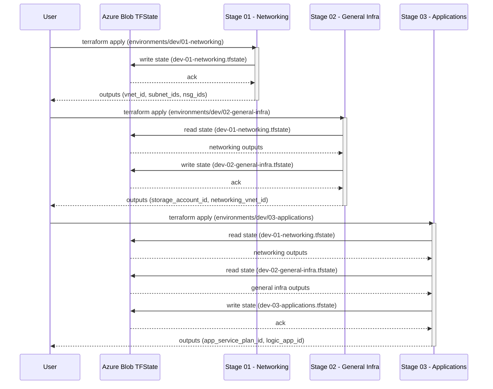

# reusable-azure-modules

Reusable Terraform modules for Azure infrastructure.

## Getting Started

### Installation

To use these modules in your Terraform configuration, reference them using the GitHub source with the production release tag:

```hcl
module "resource_group" {
  source = "github.com/YOUR-ORG/reusable-azure-modules//modules/resource-group?ref=v2.0"

  name     = "rg-production-001"
  location = "eastus"
  tags = {
    Environment = "Production"
    ManagedBy   = "Terraform"
  }
}
```

**Production Release:** `v2.0`

### Prerequisites

- [Terraform](https://www.terraform.io/downloads.html) >= 1.0
- [Azure CLI](https://docs.microsoft.com/en-us/cli/azure/install-azure-cli) installed and authenticated
- An Azure subscription
- Appropriate permissions to create resources in Azure

### Quick Start

1. **Clone the repository** (for development or contributing):
   ```bash
   git clone https://github.com/YOUR-ORG/reusable-azure-modules.git
   cd reusable-azure-modules
   ```

2. **Choose an environment** to deploy:
   ```bash
   cd environments/dev/01-networking
   ```

3. **Initialize Terraform**:
   ```bash
   terraform init
   ```

4. **Review the configuration**:
   ```bash
   terraform plan
   ```

5. **Apply the configuration**:
   ```bash
   terraform apply
   ```

### Using Modules in Your Project

Reference modules directly from GitHub in your own Terraform configurations:

```hcl
# Use a specific version tag for production
module "network" {
  source = "github.com/YOUR-ORG/reusable-azure-modules//modules/virtual-network?ref=v2.0"

  name                = "vnet-prod-001"
  location            = "eastus"
  resource_group_name = "rg-network-prod"
  address_space       = ["10.0.0.0/16"]

  # ... other configuration
}

# Or use the latest development version
module "storage" {
  source = "github.com/YOUR-ORG/reusable-azure-modules//modules/storage-account?ref=main"

  # ... configuration
}
```

## Available Modules

- **resource-group**: Creates Azure Resource Groups
- **virtual-network**: Creates Virtual Networks with Subnets and Network Security Groups
- **subnet**: Creates standalone subnets within existing Virtual Networks
- **network-security-group**: Creates Network Security Groups with custom security rules
- **vnet-peering**: Creates bi-directional VNet peering between two Virtual Networks

## Module Usage

### Resource Group

```hcl
module "resource_group" {
  source = "../../modules/resource-group"

  name     = "my-resource-group"
  location = "eastus"
  tags = {
    Environment = "dev"
    Project     = "my-project"
  }
}
```

### Virtual Network

```hcl
module "virtual_network" {
  source = "../../modules/virtual-network"

  name                = "my-vnet"
  location            = "eastus"
  resource_group_name = module.resource_group.name
  address_space       = ["10.0.0.0/16"]

  subnets = {
    subnet1 = {
      address_prefixes = ["10.0.1.0/24"]
    }
    subnet2 = {
      address_prefixes       = ["10.0.2.0/24"]
      network_security_group = "nsg1"
      delegations = {
        sqlmi = {
          name    = "Microsoft.Sql/managedInstances"
          actions = ["Microsoft.Network/virtualNetworks/subnets/join/action"]
        }
      }
    }
  }

  network_security_groups = {
    nsg1 = {
      rules = [
        {
          name                       = "allow-https"
          priority                   = 100
          direction                  = "Inbound"
          access                     = "Allow"
          protocol                   = "Tcp"
          source_port_range          = "*"
          destination_port_range     = "443"
          source_address_prefix      = "*"
          destination_address_prefix = "*"
        }
      ]
    }
  }

  tags = {
    Environment = "dev"
  }
}
```

### Subnet

```hcl
module "subnet" {
  source = "../../modules/subnet"

  name                   = "my-subnet"
  resource_group_name    = module.resource_group.name
  virtual_network_name   = module.virtual_network.name
  address_prefixes       = ["10.0.3.0/24"]

  # Optional: Associate with an NSG
  network_security_group_id = module.nsg.id

  # Optional: Add delegations
  delegations = {
    sqlmi = {
      name    = "Microsoft.Sql/managedInstances"
      actions = ["Microsoft.Network/virtualNetworks/subnets/join/action"]
    }
  }
}
```

### Network Security Group

```hcl
module "nsg" {
  source = "../../modules/network-security-group"

  name                = "my-nsg"
  location            = "eastus"
  resource_group_name = module.resource_group.name

  security_rules = [
    {
      name                       = "allow-https"
      priority                   = 100
      direction                  = "Inbound"
      access                     = "Allow"
      protocol                   = "Tcp"
      source_port_range          = "*"
      destination_port_range     = "443"
      source_address_prefix      = "*"
      destination_address_prefix = "*"
      description                = "Allow HTTPS traffic"
    },
    {
      name                       = "allow-ssh"
      priority                   = 110
      direction                  = "Inbound"
      access                     = "Allow"
      protocol                   = "Tcp"
      source_port_range          = "*"
      destination_port_range     = "22"
      source_address_prefix      = "10.0.0.0/8"
      destination_address_prefix = "*"
      description                = "Allow SSH from internal network"
    }
  ]

  tags = {
    Environment = "dev"
  }
}
```

### VNet Peering

```hcl
module "vnet_peering" {
  source = "../../modules/vnet-peering"

  peering_name_source_to_destination      = "vnet1-to-vnet2"
  peering_name_destination_to_source      = "vnet2-to-vnet1"
  source_vnet_name                        = "vnet1"
  source_vnet_id                          = module.vnet1.vnet_id
  source_vnet_resource_group_name         = module.resource_group1.name
  destination_vnet_name                   = "vnet2"
  destination_vnet_id                     = module.vnet2.vnet_id
  destination_vnet_resource_group_name    = module.resource_group2.name
  create_reverse_peering                  = true
  allow_virtual_network_access            = true
  allow_forwarded_traffic                 = false
  allow_gateway_transit                   = false
  use_remote_gateways                     = false
}
```

## Directory Structure

```
├── modules/
│   ├── resource-group/
│   ├── virtual-network/
│   ├── subnet/
│   ├── network-security-group/
│   └── vnet-peering/
└── environments/
    ├── dev/
    ├── staging/
    └── prod/
```

## Deployment Sequence

The following sequence diagram illustrates the deployment flow across the three-stage infrastructure:



## Three-Stage Deployment Architecture

This repository implements a three-stage deployment pattern for better organization and dependency management:

### Stage 01 - Networking
- Virtual Networks (VNets)
- Subnets with delegations
- Network Security Groups (NSGs)
- VNet Peering

### Stage 02 - General Infrastructure
- Storage Accounts
- Private DNS Zones
- Shared infrastructure resources

### Stage 03 - Applications
- App Service Plans
- Logic Apps Standard
- API Management
- Application-specific resources

Each stage reads outputs from previous stages using Terraform remote state, ensuring proper dependency management.

## Deployment Order

When deploying a complete environment, follow this sequence:

```bash
# Stage 01 - Networking
cd environments/dev/01-networking
terraform init
terraform apply

# Stage 02 - General Infrastructure
cd ../02-general-infra
terraform init
terraform apply

# Stage 03 - Applications
cd ../03-applications
terraform init
terraform apply
```

## Contributing

1. Fork the repository
2. Create a feature branch (`git checkout -b feature/amazing-feature`)
3. Commit your changes (`git commit -m 'Add amazing feature'`)
4. Push to the branch (`git push origin feature/amazing-feature`)
5. Open a Pull Request

## Requirements

- Terraform >= 1.0
- AzureRM Provider ~> 3.0

## License

This project is licensed under the MIT License - see the LICENSE file for details.
